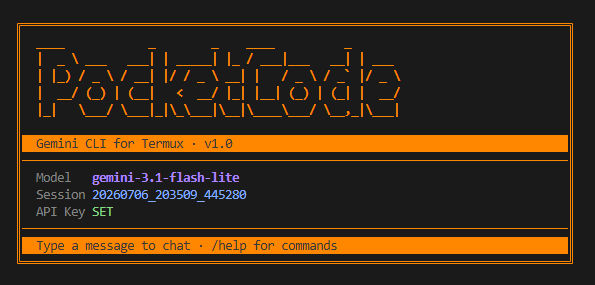

# PocketCode

A lightweight command-line AI assistant built for **Termux** on Android. PocketCode connects to **Google AI Studio (Gemini/Gemma models)** using your own API key, and lets you chat directly from your phone's terminal — no browser, no app switching.

---

## Features

- 🔑 **Single API key** — one Google AI Studio key stored locally, updateable anytime
- 🧠 **Model picker** — switch between available Gemini/Gemma text models on the fly
- 💬 **Persistent conversation memory** — chat history is saved to disk and reloaded automatically, even after closing the app
- 🧵 **Session management** — start a new conversation anytime without losing the old one
- � **Project folders** — manage a shared projects root, switch between projects, and keep each project as its own workspace
- 🛠️ **Tool use** — optional file tools, DuckDuckGo web search, and shell execution can be enabled per session via slash commands
- �📱 **Phone-first design** — minimal typing, slash-commands instead of long CLI flags
- 🚫 **No usage tracking** — no local quota counters; Google's own rate limits apply and are simply surfaced as friendly errors if hit

---

## Requirements

- [Termux](https://termux.dev/) installed on Android
- Python 3.10+
- `pip install requests`

---

## Installation

```bash
pkg update && pkg upgrade
pkg install python
pip install requests

git clone <your-repo-url> pocketcode
cd pocketcode
chmod +x pocketcode.py
```

(Optional) Add an alias so you can run it from anywhere:

```bash
echo 'alias pocketcode="python ~/pocketcode/pocketcode.py"' >> ~/.bashrc
source ~/.bashrc
```

---

## Usage

Start the app:

```bash
pocketcode
```

You'll land directly in chat mode:

```
You: hello!
AI: Hi there! How can I help you today?
```

### Slash Commands

| Command             | Description                                      |
|----------------------|--------------------------------------------------|
| `/help`              | Show all available commands                       |
| `/config`            | View current model, tool toggle states, and paths |
| `/toggle-search`     | Toggle the web search tool for the assistant (shown ON/OFF in `/help` and `/config`) |
| `/toggle-shell`      | Toggle the shell execution tool for the assistant (shown ON/OFF in `/help` and `/config`) |
| `/key <api_key>`     | Set/update your Google AI Studio API key (inline or prompted) |
| `/model`             | Pick from live-fetched or hardcoded Gemini/Gemma models |
| `/workspace [path]`  | Set or show the active project folder            |
| `/projects-root [path]` | Set or show the parent folder that holds all projects |
| `/projects`          | List existing projects and switch to one         |
| `/projects <name>`   | Create/select a project under the projects root  |
| `/toggle-search`     | Toggle the web-search tool for the assistant (ON/OFF) |
| `/toggle-shell`      | Toggle the shell-execution tool for the assistant (ON/OFF) |
| `/new`               | Start a new conversation (previous one is saved)  |
| `/history`           | Show current session messages with colored YOU/MODEL labels |
| `/clear`             | Wipe the current session                          |
| `/exit`              | Save and quit                                     |

> File tools, project selection, and optional search/shell tools are now available when enabled.

---

## Configuration Storage

PocketCode stores config and history locally on-device — nothing is sent anywhere except your chosen AI provider's API.

```
~/.pocketcode/
├── config.json        # api_key, model, workspace_path, projects_root, and tool toggles
└── sessions/
    ├── 2026-07-01_142300.jsonl
    └── 2026-07-06_091500.jsonl
```

**`config.json` example:**
```json
{
  "api_key": "AIza...",
  "model": "gemini-3.1-flash-lite",
  "workspace_path": "/home/user/pocketcode-projects/coffee-shop",
  "projects_root": "/home/user/pocketcode-projects"
}
```

⚠️ **Security note:** The API key is stored in plaintext. After first run, PocketCode sets file permissions to `600` (owner read/write only). Avoid sharing your `~/.pocketcode` folder or backing it up to shared/cloud storage without stripping the key first.

---

## Google AI Studio API Details

PocketCode talks directly to the Gemini API:

```
POST https://generativelanguage.googleapis.com/v1beta/models/{model}:generateContent?key={api_key}
```

Request body uses Gemini's `contents` / `parts` format (not OpenAI's `messages` format):
```json
{
  "contents": [
    { "role": "user", "parts": [{ "text": "hello" }] },
    { "role": "model", "parts": [{ "text": "hi there!" }] }
  ]
}
```
Note: Gemini uses `"model"` as the role name for AI replies (not `"assistant"`), so saved history must map to this when sent.

The reply text is found at `candidates[0].content.parts[0].text` in the response.

### Available Free-Tier Text Models

| Model | Daily Requests |
|---|---|
| Gemini 2.5 Flash | 20 |
| Gemini 2.5 Flash Lite | 20 |
| Gemini 3 Flash | 20 |
| Gemini 3.1 Flash Lite | 500 |
| Gemini 3.5 Flash | 20 |
| Gemma 4 26B | 1,500 |
| Gemma 4 31B | 1,500 |

PocketCode does **not** track usage locally — daily quotas reset on Google's side automatically. If a limit is hit, the API returns a `429` error, which PocketCode displays as a short friendly message rather than raw JSON.

### Error Handling

| HTTP Code | User sees |
|---|---|
| 401 | Invalid API key. Run `/key` to update it. |
| 404 | Model not found. Run `/model` to pick a valid one. |
| 429 | Rate limit reached — try again shortly. |
| 500 / 503 | Gemini server error — try again in a moment. |
| Timeout | Request timed out after 60s. |
| Safety block | Request blocked by safety filter: `<reason>` |

---

## Conversation Memory

- Each session is saved as a `.jsonl` file (one JSON message per line) under `~/.pocketcode/sessions/`
- On launch, PocketCode reloads your most recent session so you can pick up where you left off
- To avoid resending huge histories (and hitting token limits), only the last N messages are sent to the model — the full log is still kept on disk
- Use `/new` to start a fresh session without deleting the old one
- History is converted to Gemini's `contents` format at send time (see API Details below)

---

## Project Folders and Workspace Selection

PocketCode now supports a two-level project model:

- `workspace_path` = the currently active project folder that file tools operate inside
- `projects_root` = the parent folder that contains all your projects

Use these commands to manage it:

- `/projects-root <path>` — set the shared parent folder once
- `/projects` — list existing projects and choose one to activate
- `/projects <name>` — create/select a project folder under the projects root

If the AI needs to work on a new project that doesn't exist yet, it can call the built-in `create_project` tool to create and activate it automatically.

---

## Project Structure

```
pocketcode/
├── pocketcode.py       # entry point
├── repl.py             # chat loop + slash command dispatch
├── config.py           # config load/save for API key, model, workspace, projects root, and tool toggles
├── history.py          # session persistence, role validation (user/model only)
├── api.py              # Gemini generateContent calls, error mapping, tool allow-listing
├── colors.py           # ANSI colors, auto-detects Termux/Windows
├── workspace.py        # workspace/project selection and path sandboxing
├── tools.py            # file tools, project tools, optional search/shell tools
├── pocketcode.sh       # shell wrapper (Termux/Linux/WSL/Git Bash)
├── tests/
│   └── test_workspace_tools.py   # workspace/project selection and tool behavior tests
└── sessions/          # saved .jsonl conversation logs
```

---

## Testing

```bash
cd pocketcode
python -m pytest tests/
```

Currently 46 tests pass and 1 is skipped, covering config load/save, history role validation, Gemini request/response formatting, error-code mapping, workspace/project switching, and REPL command dispatch.

---

## Roadmap / Ideas

### Implemented — Workspace & Tool Use
PocketCode can now create, read, edit, and organize files inside a project folder you set, so it can act as a coding assistant rather than just a chat window.

- [x] `/workspace <path>` — set the active project folder
- [x] File tools exposed to Gemini via function calling: `list_dir`, `read_file`, `write_file`, `append_file`, `create_folder`, `delete_file`, `move_or_rename`
- [x] Path sandboxing — every tool call is confined to the workspace root; attempts to escape it (`../`, absolute paths, symlinks) are rejected before touching disk
- [x] Confirmation prompt before **every** write/delete/move — shows a preview, requires `y/n`. Read-only operations (`list_dir`, `read_file`) run automatically
- [x] `/config` shows the active workspace path and tool toggle state
- [x] `/projects-root` and `/projects` manage a shared projects directory and project selection
- [x] Optional DuckDuckGo search and shell tools can be enabled with `/toggle-search` and `/toggle-shell`

### Other ideas
- [ ] Token-based (not just message-count-based) history trimming
- [ ] Live-fetch available models from Google's `/models` endpoint instead of a hardcoded list
- [ ] Optional encrypted key storage via `termux-api` / Android Keystore
- [ ] Export a session to plain text or Markdown
- [ ] Short diff view (instead of full content) in write-confirmation previews for long files
- [ ] `/tools` command to list what the AI is currently allowed to do

---

## License

MIT (or your preferred license — update this section)